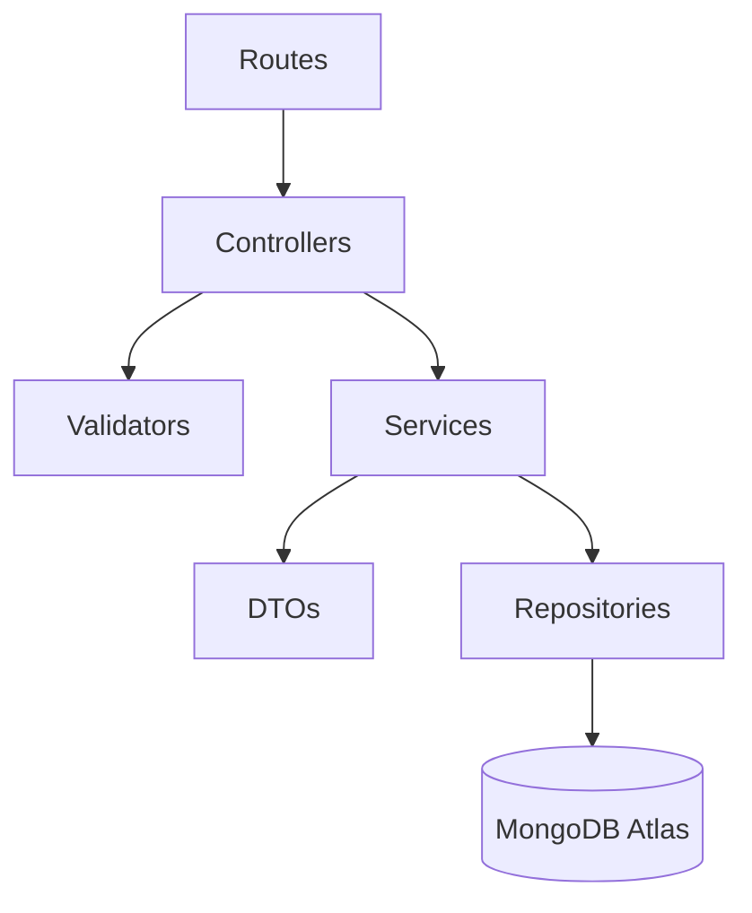

# EVCorn Master Architectural Reference Document

> **Document Status:** Active Standard (Phases 1–3 Complete)  
> **Version:** 1.0.0  
> **Target Scale:** 5,000+ Vehicles • 5,000+ Articles • 10M Monthly Visitors  
> **Core Stack:** Angular 18 (SSR/ISR) • Node.js / Express • MongoDB Atlas • Cloudinary CDN • Vercel Edge Network  

---

## 1. System Philosophy & Monorepo Layout

EVCorn is built as a clean, production-grade **Full-Stack Monorepo** located at `/Users/sachin/Desktop/evcorn`.

```
evcorn/
├── frontend/                  # Angular 18 Web Application (Vercel Edge Network)
├── backend/                   # Node.js / Express Layered API (Render Web Service)
└── docs/
    └── ARCHITECTURE.md        # Master Architecture Standard (This Reference Document)
```

---

## 2. Domain Model & Hierarchy Standard

```
Brand (e.g. Tata Motors)
 │
 └── Model (e.g. Nexon EV)
      │
      └── Variant (e.g. Empowered+ Long Range) ──► Represents physical vehicle document
           ├── Specifications (Battery, Dimensions, Safety)
           ├── Pricing (Ex-showroom, On-road, Subsidy)
           ├── Charging (AC, DC Fast)
           ├── Performance (Range, Power, Torque)
           └── Media (Main Image, Gallery Angles)
```

### Core Domain Principles:
1. **Vehicles Represent Variants:** A Vehicle document in EVCorn ultimately represents a specific **Variant**, not a brand or model family.
2. **Stable Identifiers:** Every entity level maintains immutable, unique slug identifiers:
   - `brandId`, `brandSlug` (e.g. `tata`)
   - `modelId`, `modelSlug` (e.g. `nexon-ev`)
   - `variantId`, `variantSlug` (e.g. `nexon-ev-empowered-plus-lr`)
3. **No String Delimiters:** Data must never be stored using string delimiters like `||`, `;;;`, or `###`. All spec properties are typed sub-documents (`pricing`, `battery`, `charging`, `performance`, `dimensionsObj`, `media`, `safety`, `seo`).

---

## 3. Layered Backend Architecture

```
Request
   │
   ▼
Routes                 (backend/routes/*)
   │
   ▼
Controllers            (backend/controllers/*)
   │
   ▼
Services               (backend/services/*)
   │
   ▼
Repositories           (backend/repositories/*)
   │
   ▼
MongoDB Atlas / FileDB (backend/models/* & backend/config/database.js)
```

### Layer Responsibilities:
1. **Routes (`backend/routes/`):** Endpoint path definitions and middleware binding.
2. **Controllers (`backend/controllers/`):** Lightweight request receivers, basic validator invocation, service calls, and response dispatchers. Zero DB queries.
3. **Services (`backend/services/`):** Domain business logic, data transformation, validation, and Cloudinary orchestration.
4. **Repositories (`backend/repositories/`):** Isolated database operations (`find`, `findOne`, `count`, `upsert`, `delete`). Zero business logic.
5. **DTOs (`backend/dto/`):** Response formatting, property normalization, and legacy field fallbacks.
6. **Validators (`backend/validators/`):** Input payload, ID, and query parameter validation.
7. **Middlewares (`backend/middlewares/`):** Auth verification and centralized global error handling.
8. **Utils & Config (`backend/utils/`, `backend/config/`):** Query builders, structured logger, database connection, Cloudinary config.

---

## 4. API Design Principles & Standards

1. **Standardized Envelope Response:**
   Paginated or envelope-formatted responses return a unified JSON payload:
   ```json
   {
     "success": true,
     "data": [...],
     "meta": {
       "page": 1,
       "limit": 20,
       "total": 500,
       "pages": 25
     }
   }
   ```
2. **Standardized Error Envelope:**
   All operational API errors return a consistent error object:
   ```json
   {
     "success": false,
     "error": {
       "code": "INVALID_REQUEST_PAYLOAD",
       "message": "Vehicle field \"name\" is required.",
       "details": null
     }
   }
   ```
3. **Server-Side Pagination:** `?page=1&limit=20`. Limits are hard-capped at 100 (`MAX_LIMIT = 100`).
4. **Server-Side Filtering:** Filtering executes in MongoDB queries (`brand`, `model`, `priceMin`, `priceMax`, `rangeMin`, `rangeMax`, `batteryMin`, `batteryMax`, `status`, `search`).
5. **Server-Side Sorting & Whitelisting:** `sort=price|range|battery|name|publishedAt|createdAt` and `order=asc|desc`.
6. **Field Selection:** `fields=id,name,price,range,imageUrl` returns only requested fields.
7. **Lean Execution:** All read queries must execute `.lean()` to minimize V8 memory overhead.

---

## 5. Strict Dependency Rules



### Strict Architectural Directives:
- ❌ Repositories must NEVER call Controllers or Services.
- ❌ Controllers must NEVER access MongoDB directly (`Vehicle.find()` in controller is forbidden).
- ❌ Services must NEVER import Route files.
- ❌ DTOs must remain independent of controllers and database drivers.

---

## 6. Complete Backend Folder Structure

```
backend/
├── config/             # env.js, database.js, cloudinary.js
├── constants/          # api.constants.js
├── errors/             # AppError.js
├── utils/              # logger.js, apiQuery.js
├── dto/                # vehicle.dto.js, article.dto.js, category.dto.js
├── validators/         # vehicle.validator.js, article.validator.js, query.validator.js
├── repositories/       # vehicle.repository.js, article.repository.js, category.repository.js
├── services/           # vehicle.service.js, article.service.js, category.service.js, upload.service.js
├── controllers/        # vehicle.controller.js, article.controller.js, category.controller.js, upload.controller.js, auth.controller.js
├── middlewares/        # auth.middleware.js, error.middleware.js
├── routes/             # vehicle.routes.js, article.routes.js, category.routes.js, upload.js, auth.routes.js, index.js
├── models/             # Vehicle.js, Article.js, Category.js
├── scripts/            # migrate-vehicles.js
└── server.js           # Lightweight Express bootstrap
```

---

## 7. Coding Conventions & Best Practices

1. **No Magic Strings:** Access environment variables through `config/env.js` and constants through `constants/api.constants.js`.
2. **Centralized Logging:** Use `logger.info()`, `logger.warn()`, `logger.error()` from `utils/logger.js`. Avoid scattered `console.log()`.
3. **Idempotency:** Data migration utilities must be idempotent (can run twice without corrupting data) and create timestamped backups.
4. **Validation First:** Controllers must validate inputs via `validators/` before delegating to Services.

---

## 8. Backward Compatibility & Deprecation Sunset Policy

1. **Dual-Model Compatibility:** API endpoints return BOTH typed nested domain objects (`pricing`, `battery`, `charging`, `performance`, `dimensionsObj`, `media`, `safety`, `seo`) AND legacy flat fallbacks (`price`, `batteryCapacity`, `dimensions`).
2. **Zero Breaking Changes:** Existing frontend URLs, page behaviors, and Admin workflows must remain 100% functional throughout all architectural refactorings.
3. **Deprecation Sunset:** Top-level legacy flat fallback fields will be permanently removed in Phase 3 of scale, only after all frontend consumers have migrated to typed nested domain properties.
